# Casos de uso — Telegram como consola remota de OpenCode

## Alcance de este documento
Este documento describe los flujos principales del producto objetivo y marca si cada uno:

- **Existe hoy**,
- **es prototipo parcial**,
- o **falta implementar**.

## Estado general actual
- **Hoy existe:** bot Telegram local por polling, envío de texto libre, llamada HTTP simple a OpenCode, mock local y scripts de arranque.
- **Hoy es prototipo:** canal de mensajería básico; no hay modelo de proyecto ni sesión.
- **Hoy falta:** asociación de proyecto, asociación/creación de sesión, notificaciones por watcher, recuperación real y control de concurrencia.

---

## 1) Asociación de proyecto
**Objetivo:** vincular un proyecto local a un chat autorizado para poder operar sobre él desde Telegram.

**Estado:** **falta**.

**Resultado esperado:** queda un proyecto registrado y, opcionalmente, marcado como activo.

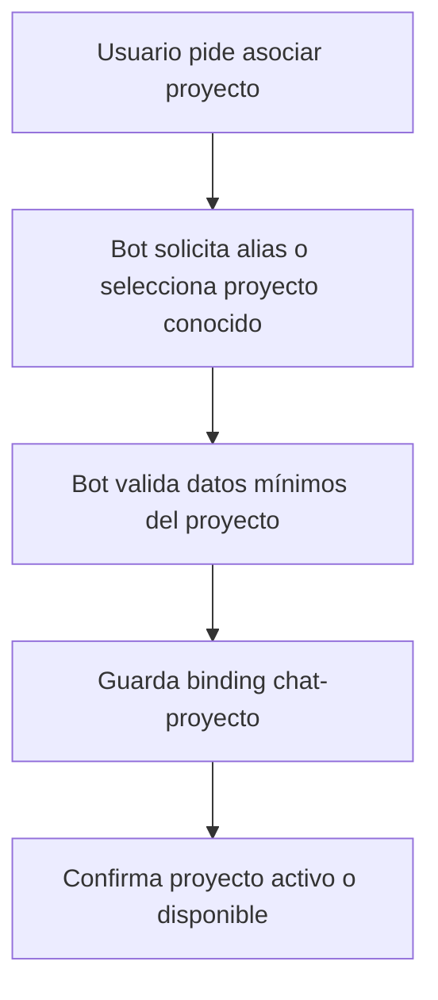

---

## 2) Asociación de sesión existente
**Objetivo:** conectar Telegram con una sesión de OpenCode ya iniciada en la PC.

**Estado:** **falta**.

**Resultado esperado:** el chat queda asociado a un `sessionId` existente dentro del proyecto activo.

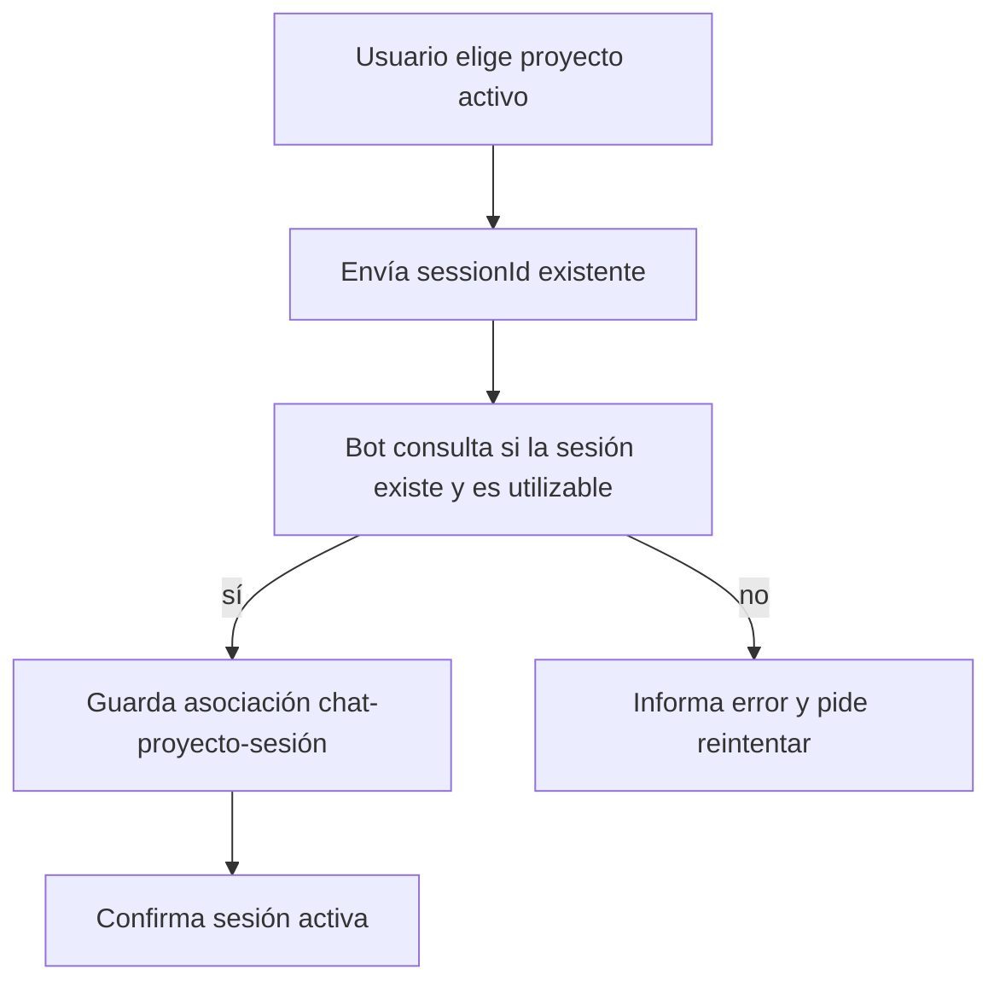

---

## 3) Creación de nueva sesión
**Objetivo:** abrir una sesión nueva sobre el proyecto activo cuando no sirve continuar la anterior.

**Estado:** **falta**.

**Resultado esperado:** se crea una nueva sesión y pasa a ser la activa para el chat.

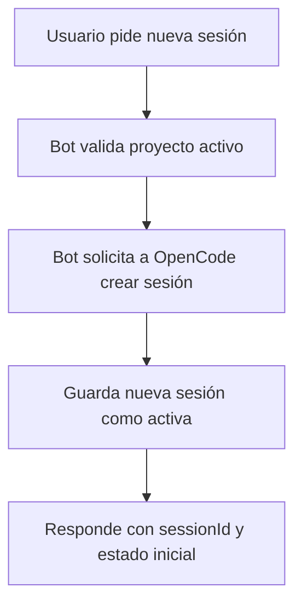

---

## 4) Continuación de sesión con mensaje libre
**Objetivo:** seguir una sesión activa desde Telegram usando lenguaje libre.

**Estado:** **hoy existe parcialmente** como prototipo, pero sin noción real de sesión.

**Resultado esperado:** el mensaje entra a la sesión activa y la respuesta vuelve al chat correcto.

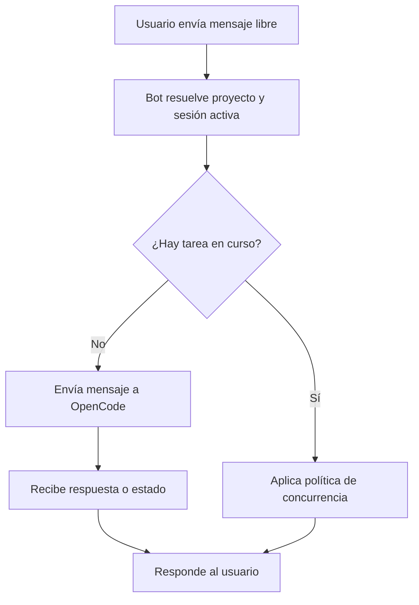

---

## 5) Ejecución de comandos SDD/orquestador desde Telegram
**Objetivo:** disparar acciones estructuradas como continuar flujo, crear cambio o pedir estado.

**Estado:** **falta**.

**Resultado esperado:** el bot interpreta el comando, ejecuta la acción sobre la sesión activa y devuelve resultado o acuse.

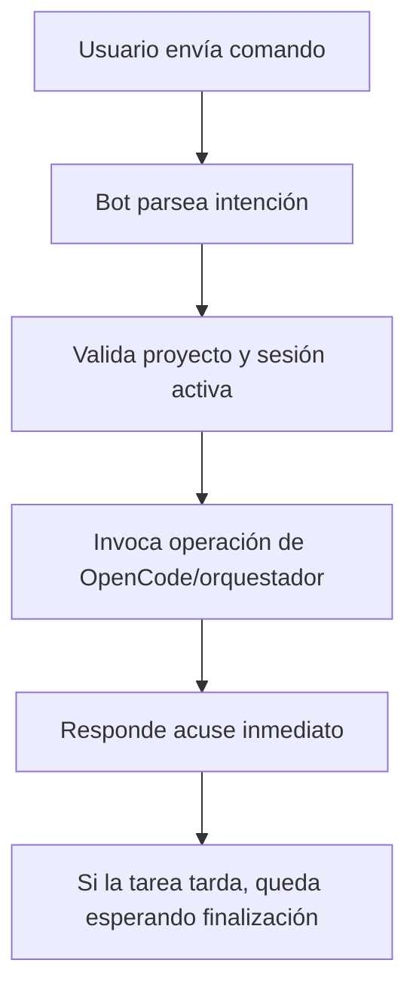

---

## 6) Notificación cuando termina una tarea iniciada desde Telegram
**Objetivo:** avisar que una tarea lanzada desde Telegram terminó.

**Estado:** **falta como flujo explícito**. Hoy solo existe respuesta sin seguimiento formal de tarea.

**Resultado esperado:** el usuario recibe una notificación final con resultado o siguiente acción.

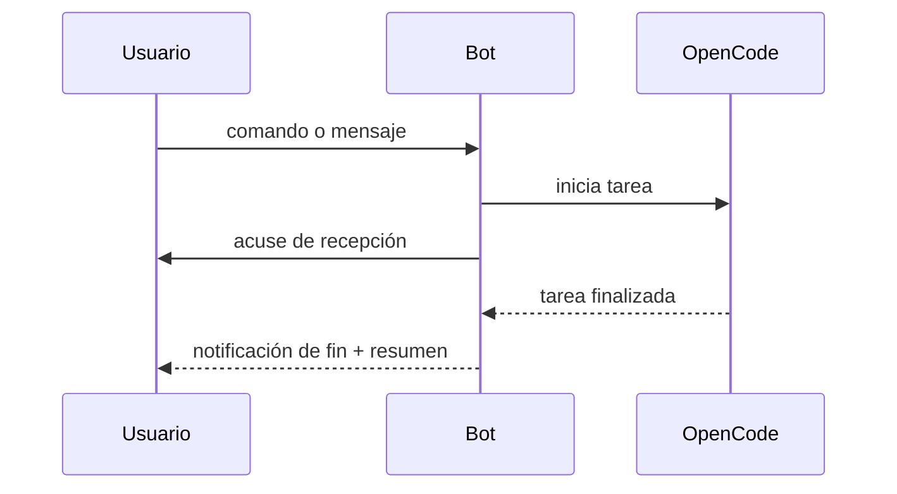

---

## 7) Notificación cuando termina una tarea iniciada desde la PC
**Objetivo:** avisar por Telegram que una tarea de una sesión observada terminó aunque se haya iniciado fuera del bot.

**Estado:** **falta**. Este es el salto a **Nivel 2**.

**Resultado esperado:** Telegram recibe el fin de tarea sin que el usuario haya iniciado esa ejecución desde el bot.

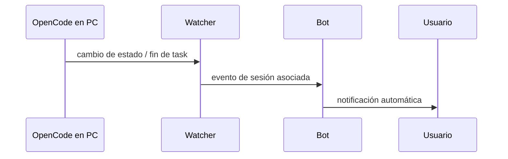

---

## 8) Respuesta/interacción cuando el orquestador pide confirmación
**Objetivo:** permitir que el usuario confirme o responda una pregunta del orquestador desde Telegram.

**Estado:** **falta**.

**Resultado esperado:** el flujo queda pausado esperando input y luego se reanuda con la respuesta del usuario.

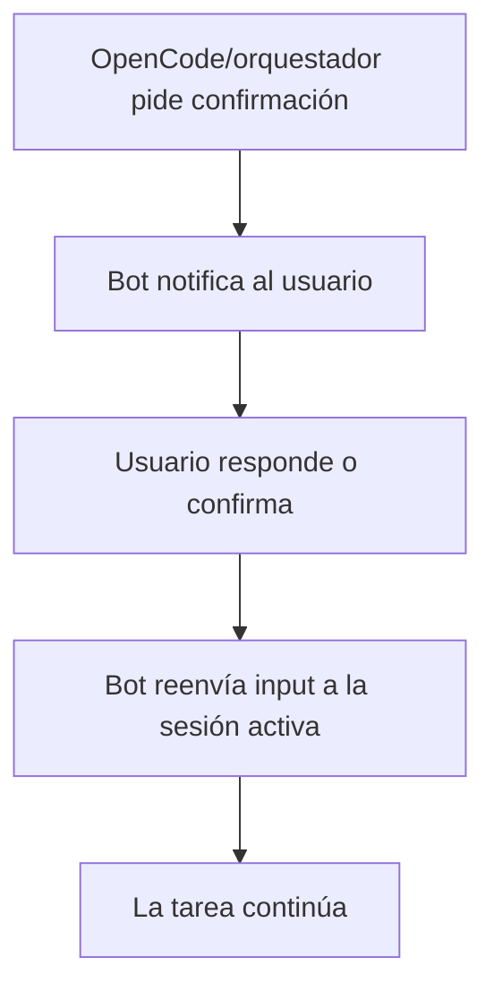

---

## 9) Cambio de proyecto
**Objetivo:** cambiar el proyecto activo del chat sin perder el registro de otros proyectos asociados.

**Estado:** **falta**.

**Resultado esperado:** otro proyecto pasa a ser el activo y la sesión asociada se actualiza o se invalida explícitamente.

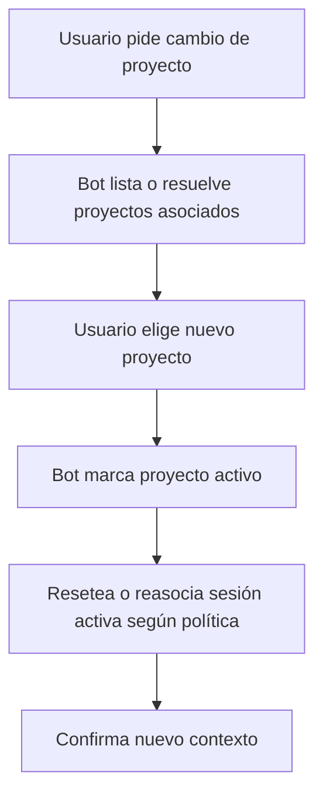

---

## 10) Consulta de estado
**Objetivo:** saber rápidamente qué proyecto/sesión está activa y si hay algo corriendo o esperando respuesta.

**Estado:** **falta**.

**Resultado esperado:** el bot devuelve un resumen corto y confiable del contexto operativo.

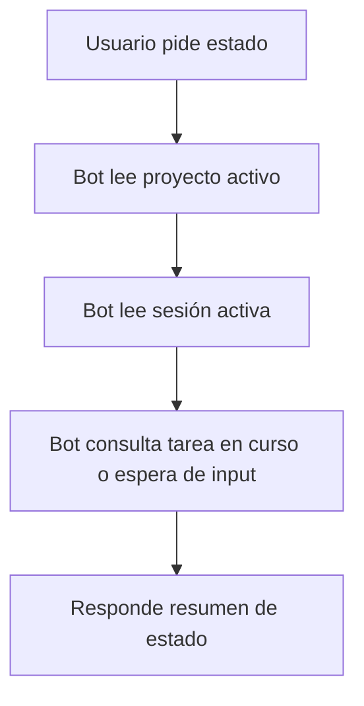

---

## 11) Recuperación tras reinicio del bot
**Objetivo:** restaurar bindings mínimos y evitar que un reinicio deje al usuario completamente ciego.

**Estado:** **falta**.

**Resultado esperado:** al arrancar, el bot rehidrata asociaciones persistidas y puede continuar o informar cómo reanudar.

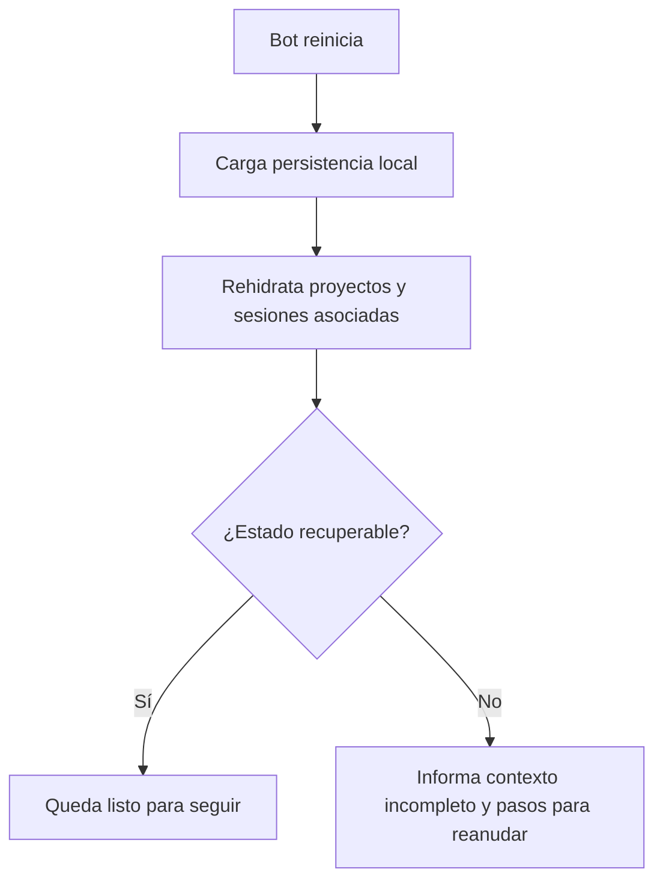

---

## 12) Manejo de concurrencia / tarea ya en curso
**Objetivo:** evitar que PC y Telegram rompan la misma sesión con órdenes simultáneas o ambiguas.

**Estado:** **falta**.

**Resultado esperado:** el usuario recibe una respuesta explícita cuando ya hay trabajo en curso y el sistema aplica una política consistente.

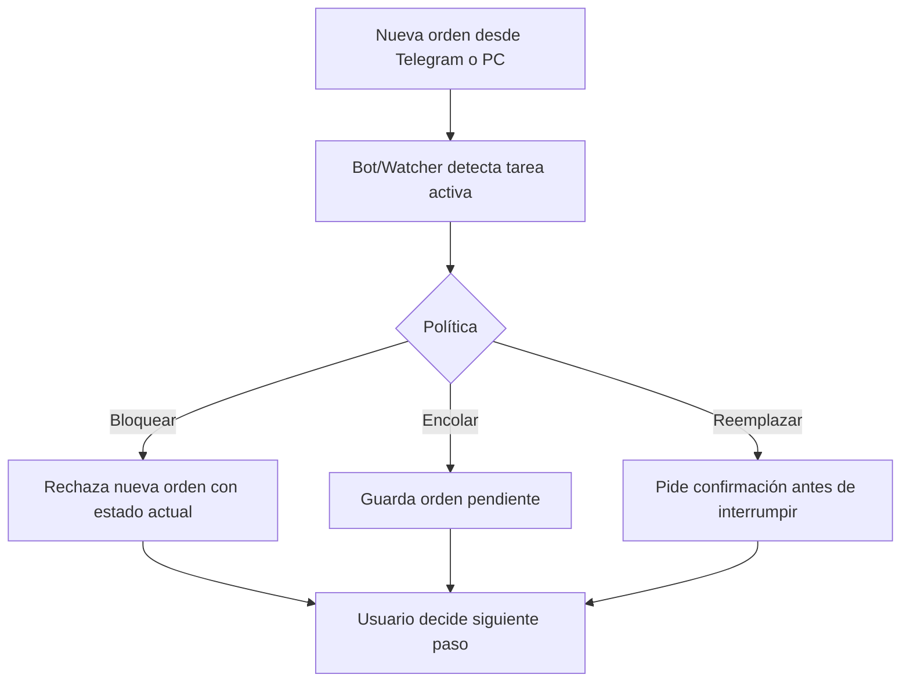

---

## Agrupación por fases

### v0.1 — base usable de cliente remoto
- Asociación de proyecto
- Asociación de sesión existente
- Creación de nueva sesión
- Continuación con mensaje libre
- Comandos SDD/orquestador
- Cambio de proyecto
- Consulta de estado
- Recuperación tras reinicio
- Política básica de concurrencia

### v1 / v1.1 — observación y continuidad real fuera de la PC
- Notificación de tareas iniciadas desde Telegram con modelo formal de task
- Notificación de tareas iniciadas desde la PC
- Confirmaciones del orquestador desde Telegram
- Watcher de sesión compartida

## Resumen franco
- **Lo que hoy existe:** forwarding local por polling y mock de OpenCode.
- **Lo que puede reutilizarse:** transporte Telegram, config, cliente HTTP, logs, scripts.
- **Lo que falta de verdad para el producto nuevo:** estado de proyecto/sesión, persistencia, comandos, watcher, recuperación y concurrencia.
