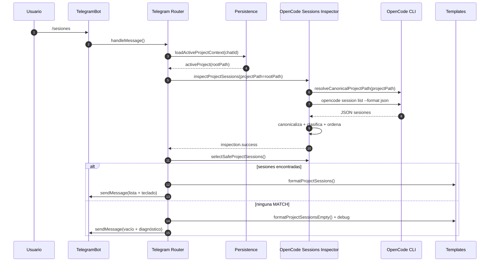
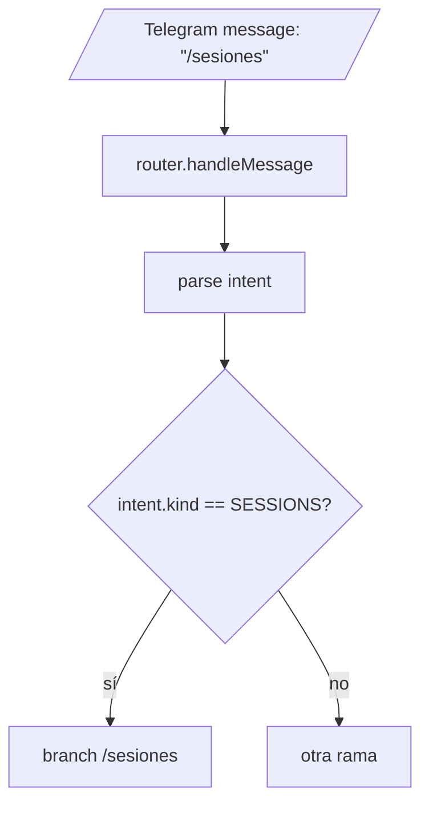
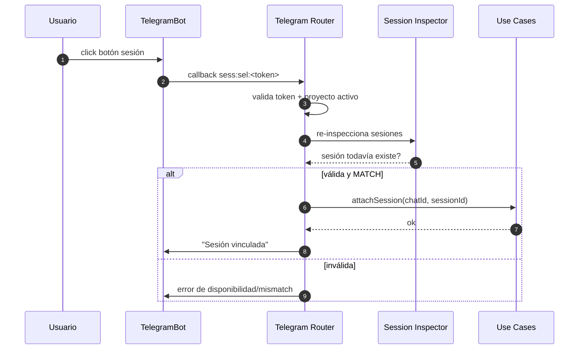

# Flujo `/sesiones` en Telegram → OpenCode → respuesta al chat

Este documento explica el recorrido completo cuando el usuario ejecuta `/sesiones` en Telegram, hasta que el bot responde con la lista (o con vacío/debug).

---

## 1) Vista rápida



---

## 2) Mapa de funciones involucradas

### Entrada Telegram
- `src/adapters/telegram/router.ts`
  - `handleMessage(...)`
  - rama `TELEGRAM_COMMAND_INTENT_KIND.SESSIONS`

### Inspección de sesiones
- `src/infrastructure/opencode-project-sessions.ts`
  - `inspectProjectSessions(...)`
  - `classifySessionCandidate(...)`
  - `belongsToProject(...)`
  - `selectSafeProjectSessions(...)`

### CLI OpenCode
- `src/infrastructure/opencode-cli.ts`
  - `listSessions(...)`
  - `resolveCanonicalProjectPath(...)`
  - `runOpenCodeCli(...)`
  - `parseOpenCodeCliSessionList(...)`

### Render Telegram
- `src/adapters/telegram/templates.ts`
  - `formatProjectSessions(...)`
  - `formatProjectSessionsEmpty(...)`
  - `formatProjectSessionsEmptyDebug(...)`
  - `formatProjectSessionLine(...)`

---

## 3) Paso a paso real del código

### Paso 1 — Telegram recibe `/sesiones`
El bot entra por el router principal.



### Paso 2 — buscar proyecto activo
El router consulta la persistencia para saber qué proyecto está activo en ese chat.

```mermaid
flowchart TD
  A[branch /sesiones] --> B[loadActiveProjectContext(chatId)]
  B --> C{hay proyecto activo?}
  C -->|no| D[formatProjectSessionsRequireProject()]
  D --> E[sendMessage al chat]
  C -->|sí| F[seguir a inspección]
```

### Paso 3 — resolver path canónico del proyecto
`inspectProjectSessions()` recibe el `rootPath` del proyecto y lo normaliza con `resolveCanonicalProjectPath(...)`.

Qué hace:
- verifica que exista el directorio;
- verifica que sea directorio real;
- devuelve `fs.realpath(...)`.

Esto importa porque después la comparación es contra la ruta canónica, no contra el texto crudo guardado.

### Paso 4 — listar sesiones desde OpenCode
`listSessions()` ejecuta:

```bash
opencode session list --format json
```

Después:
- captura `stdout`;
- parsea JSON;
- acepta salida tipo array o `{ items: [...] }`;
- extrae campos:
  - `id` / `sessionId` / `session_id`
  - `path` / `dir` / `directory`
  - `title` / `name`
  - timestamps `created/updated`

### Paso 5 — clasificar cada sesión
Cada sesión se evalúa con `classifySessionCandidate(...)`.

```mermaid
flowchart TD
  A[sesión OpenCode] --> B{tiene path?}
  B -->|no| U[UNSAFE]
  B -->|sí| C[resolveCanonicalProjectPath(path)]
  C --> D{canonicaliza?}
  D -->|no| U
  D -->|sí| E{belongsToProject?}
  E -->|sí| M[MATCH]
  E -->|no| P[PROJECT_MISMATCH]
```

Regla exacta de pertenencia:
- igual al root canónico del proyecto, o
- descendiente dentro del árbol del proyecto.

### Paso 6 — ordenar el resultado
Las sesiones inspeccionadas se ordenan con `compareProjectSessions(...)`:

1. primero por `updatedAt` descendente si ambos tienen timestamp válido;
2. si uno tiene timestamp y el otro no, el que tiene timestamp va primero;
3. si ninguno tiene timestamp, desempata por `sessionId`.

### Paso 7 — filtrar solo seguras
`selectSafeProjectSessions(...)` deja pasar solo `MATCH`.

Eso significa que se ocultan:
- `UNSAFE`
- `PROJECT_MISMATCH`

Por eso puede pasar que OpenCode tenga sesiones, pero Telegram diga que no hay: si ninguna quedó en `MATCH`, la lista queda vacía.

### Paso 8 — responder al chat
Hay dos caminos:

#### 8A. Hay sesiones
El router:
- toma la primera página (`5` ítems);
- arma teclado inline;
- manda mensaje con `formatProjectSessions(...)`.

#### 8B. No hay sesiones
El router manda:
- `formatProjectSessionsEmpty()`
- más un debug compacto `formatProjectSessionsEmptyDebug(...)`

---

## 4) Cómo se arma la UI en Telegram

### Texto principal
`formatProjectSessions(...)` renderiza:

- título: `Sesiones del proyecto actual`
- contexto: `projectPath`
- líneas:
  - `Seleccioná una sesión para vincularla a este chat:`
  - cada sesión como `• <title>`

### Botones
Cada sesión visible genera un botón inline con callback:

```text
sess:sel:<token>
```

Si hay más de 5 sesiones:
- aparece paginación con `sesspg:<page>`

### Debug cuando está vacío
Si no hay sesiones `MATCH`, el bot agrega diagnóstico:

- `rootPath` comparado
- total de sesiones vistas por OpenCode
- conteo por asociación
- hasta 5 sesiones inspeccionadas con:
  - `sessionId`
  - `association`
  - `path`

---

## 5) Diagrama completo del flujo de datos

```mermaid
flowchart LR
  A[/Usuario: /sesiones/] --> B[router.handleMessage]
  B --> C[loadActiveProjectContext]
  C --> D{proyecto activo?}
  D -->|no| E[Mensaje: elegir /project]
  D -->|sí| F[inspectProjectSessions]
  F --> G[resolveCanonicalProjectPath(rootPath)]
  F --> H[opencode session list --format json]
  H --> I[parseOpenCodeCliSessionList]
  I --> J[classifySessionCandidate por sesión]
  J --> K[sort compareProjectSessions]
  K --> L[selectSafeProjectSessions]
  L --> M{MATCHs?}
  M -->|sí| N[formatProjectSessions + keyboard]
  M -->|no| O[formatProjectSessionsEmpty + debug]
  N --> P[Telegram sendMessage]
  O --> P
```

---

## 6) Por qué puede verse vacío aunque OpenCode tenga sesiones

Esto es lo más importante para debug.

### Caso 1 — `path` faltante
La sesión entra como `UNSAFE`.

### Caso 2 — `path` no canonicalizable
También termina como `UNSAFE`.

### Caso 3 — path de otra carpeta
Termina como `PROJECT_MISMATCH`.

### Caso 4 — OpenCode y Telegram miran contextos distintos
Ejemplos:
- otro `HOME`
- otra instancia de OpenCode
- otra sesión/usuario de sistema
- el proyecto guardado en Telegram no coincide con el `realpath`

### Caso 5 — el proyecto activo quedó guardado con path distinto
Aunque visualmente parezca igual, si el `realpath` difiere, puede fallar la asociación.

---

## 7) Flujo cuando el usuario elige una sesión

Esto ya es la segunda etapa del mismo flujo.



---

## 8) Puntos exactos a mirar si falla

1. `loadActiveProjectContext(...)`
   - ¿qué `rootPath` quedó guardado?

2. `resolveCanonicalProjectPath(...)`
   - ¿el path canónico coincide con el esperado?

3. `opencode session list --format json`
   - ¿la sesión tiene `directory/path`?

4. `classifySessionCandidate(...)`
   - ¿queda `MATCH` o no?

5. `selectSafeProjectSessions(...)`
   - solo deja `MATCH`.

6. `formatProjectSessionsEmptyDebug(...)`
   - si aparece vacío, ahí tenés el diagnóstico.

---

## 9) Resumen corto

El flujo real es:

1. Telegram recibe `/sesiones`
2. Router carga proyecto activo
3. OpenCode CLI lista sesiones
4. El código canónica y clasifica cada sesión
5. Solo `MATCH` llegan a la UI
6. Telegram muestra lista o vacío + debug

---

## 10) Archivos clave

- `src/adapters/telegram/router.ts`
- `src/infrastructure/opencode-project-sessions.ts`
- `src/infrastructure/opencode-cli.ts`
- `src/adapters/telegram/templates.ts`
