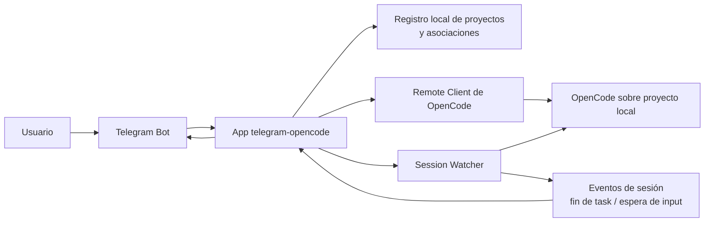
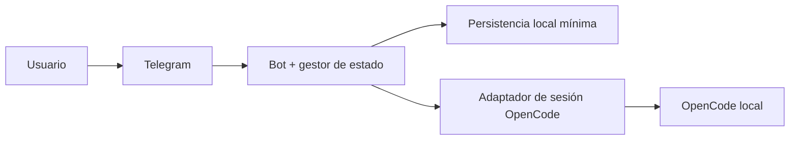
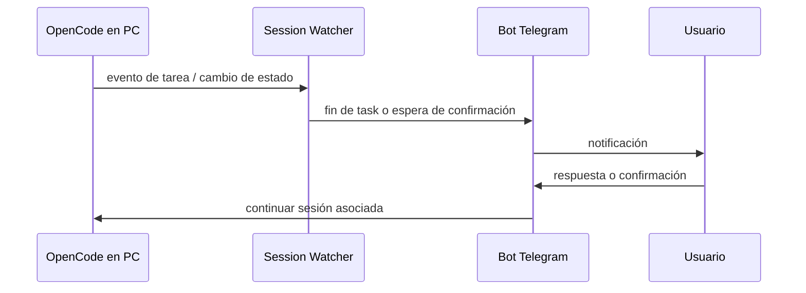

# PRD v0.1 — Telegram como consola remota de OpenCode

## Resumen del producto
`telegram-opencode` ya no se define como un bot que reenvía prompts por HTTP. El producto objetivo es un **bot de Telegram que actúa como cliente remoto de OpenCode para proyectos locales**, y además como **observador/notificador** de sesiones que pueden haberse iniciado o continuado desde la PC.

La idea es simple: el usuario trabaja en OpenCode sobre un proyecto local, se va de la PC, asocia ese proyecto y una sesión al bot, recibe avisos cuando una tarea termina o cuando el orquestador pide confirmación, y puede seguir respondiendo desde Telegram sin perder continuidad.

## Problema que resuelve
Hoy OpenCode se usa bien desde la PC, pero cuando el usuario se aleja pierde visibilidad y capacidad de reacción:

- no recibe avisos confiables cuando termina una tarea,
- no puede continuar cómodamente una sesión desde Telegram,
- no tiene una forma explícita de asociar proyecto y sesión activa,
- y si la sesión anterior ya cerró su flujo, no puede abrir otra sobre el mismo proyecto con una UX pensada para remoto.

## Objetivo del producto
Construir un canal remoto y liviano para trabajar con OpenCode sobre proyectos locales, con foco en continuidad de sesión, notificaciones útiles y control básico desde Telegram.

## Visión y fase inicial
- **Producto objetivo (v1):** integración **Nivel 2**: cliente remoto + observador/notificador de sesiones iniciadas o continuadas fuera del bot.
- **Primera iteración (v0.1):** llevar el prototipo actual a una base de **Nivel 1 usable**:
  - asociación de proyecto,
  - asociación de sesión existente,
  - creación de nueva sesión,
  - continuidad de sesión desde Telegram,
  - comandos básicos de control/estado.
- **Evolución (v1.1):** sumar watcher de sesión compartida, notificaciones automáticas de tareas iniciadas desde la PC y manejo de confirmaciones del orquestador fuera del bot.

## Alcance del producto objetivo
Incluye:

- asociar uno o más proyectos locales al usuario/chat autorizado,
- seleccionar proyecto activo,
- asociar una sesión OpenCode existente a Telegram,
- crear una nueva sesión sobre el proyecto activo,
- enviar mensajes libres y comandos SDD/orquestador desde Telegram,
- recibir respuestas finales y pedidos de confirmación,
- observar sesiones iniciadas/continuadas desde la PC,
- notificar fin de tarea, espera de input y estado de sesión,
- recuperar contexto operativo tras reinicio del bot.

No incluye, por ahora:

- operación multiusuario compleja con roles finos,
- UI web o panel aparte,
- hosting cloud full-time,
- soporte multimedia como canal principal.

## Alcance de la primera iteración (v0.1)
Incluye:

- registro manual de proyectos locales reutilizando configuración existente,
- selección/cambio de proyecto activo,
- asociación manual de `sessionId` existente,
- creación de nueva sesión para el proyecto activo,
- envío de mensajes y comandos desde Telegram a la sesión activa,
- consulta de estado y protección básica contra tareas concurrentes,
- persistencia mínima local para proyecto/sesión/chat activo.

Queda fuera de v0.1:

- watcher de sesiones iniciadas desde la PC,
- notificaciones automáticas de tareas originadas fuera de Telegram,
- cola/event stream de estados de OpenCode,
- recuperación avanzada de flujos interrumpidos.

## Qué de lo ya implementado sirve y se reutiliza
Lo actual **sirve como prototipo técnico**, no como producto final. Reutilizable:

- bot local por polling con `node-telegram-bot-api`,
- carga de configuración y secretos vía `.env`,
- cliente HTTP a OpenCode con timeout y retry básico,
- logging simple,
- scripts `start:local` / `stop:local`,
- mock local de OpenCode para pruebas manuales.

## Qué de lo implementado actual no alcanza o debe reemplazarse
Lo actual **no alcanza** para la nueva visión porque:

- asume un único flujo “mensaje → HTTP → respuesta”,
- no modela **proyecto**, **sesión**, **chat asociado** ni **estado operativo**,
- no distingue tareas iniciadas desde Telegram vs desde PC,
- no soporta comandos ni confirmaciones del orquestador,
- no persiste asociaciones para reinicios,
- no observa eventos de sesiones compartidas,
- el mensaje de bienvenida actual no representa el ciclo real del producto.

En consecuencia, la lógica de handlers y el contrato con OpenCode deberán **evolucionar o reemplazarse** por una capa de sesiones/eventos.

## Requisitos funcionales
- **RF1.** El bot debe permitir asociar proyectos locales con un identificador estable y metadatos mínimos.
- **RF2.** El usuario debe poder seleccionar un proyecto activo desde Telegram.
- **RF3.** El bot debe permitir asociar una sesión OpenCode existente al proyecto activo.
- **RF4.** El bot debe permitir crear una nueva sesión OpenCode para el proyecto activo.
- **RF5.** El usuario debe poder enviar mensajes libres a la sesión activa desde Telegram.
- **RF6.** El bot debe permitir ejecutar comandos SDD/orquestador predefinidos desde Telegram.
- **RF7.** El bot debe informar el estado actual: proyecto activo, sesión activa, tarea en curso y si espera confirmación.
- **RF8.** El bot debe evitar o resolver de forma explícita la concurrencia cuando ya hay una tarea en curso.
- **RF9.** El bot debe notificar cuando termina una tarea iniciada desde Telegram.
- **RF10.** El producto objetivo debe notificar cuando termina una tarea iniciada desde la PC sobre una sesión observada.
- **RF11.** El producto objetivo debe notificar cuando el orquestador queda esperando confirmación o input humano.
- **RF12.** Tras reinicio, el bot debe recuperar asociaciones mínimas para continuar operación o informar cómo reanudar.

## Requisitos no funcionales
- **RNF1. Claridad operativa:** cada mensaje debe dejar claro si algo existe hoy, es prototipo o falta.
- **RNF2. Persistencia mínima:** las asociaciones críticas deben sobrevivir reinicios del bot.
- **RNF3. Seguridad:** no exponer tokens, rutas sensibles ni datos del proyecto en logs o chats no autorizados.
- **RNF4. Latencia:** acciones interactivas de Telegram deberían responder con acuse rápido, aunque la tarea larga termine después.
- **RNF5. Observabilidad:** registrar eventos de asociación, inicio/fin de tarea, errores y recuperación.
- **RNF6. Robustez:** tolerar reinicios del bot y reconexiones sin perder el mapeo principal proyecto/sesión/chat.
- **RNF7. Extensibilidad:** separar transporte Telegram, integración OpenCode y almacenamiento local para poder evolucionar a Nivel 2.

## Arquitectura propuesta

### Vista general objetivo (v1)

### Fase inicial v0.1

### Recuperación y observación en Nivel 2

## Estado actual vs objetivo

| Tema | Hoy | Sirve | Falta para visión nueva |
|---|---|---|---|
| Bot Telegram local | Sí | Sí | Agregar comandos, estado y control de sesión |
| Polling local | Sí | Sí | Mantener en v0.1; luego evaluar eventos/watcher |
| Cliente HTTP a OpenCode | Sí | Parcial | Debe evolucionar a API de sesión/ejecución/estado |
| Mock OpenCode | Sí | Sí | Extenderlo para sesiones y eventos |
| Scripts locales | Sí | Sí | Mantener |
| Asociación proyecto/sesión | No | No | Crear desde cero |
| Persistencia tras reinicio | No | No | Crear desde cero |
| Notificaciones de tareas iniciadas desde PC | No | No | Requiere watcher/eventos |

## Roadmap de RFCs necesarios

### RFC-002 — Modelo de proyecto, sesión y asociación con Telegram
**Qué se hace:** definir entidades mínimas (`project`, `session`, `chatBinding`, `activeTask`) y persistencia local.
**Por qué hace falta:** sin ese modelo no existe continuidad real ni recuperación tras reinicio.

### RFC-003 — API/adaptador de OpenCode para sesiones remotas
**Qué se hace:** reemplazar el contrato simple de prompt por operaciones orientadas a sesión: asociar, crear, continuar, consultar estado.
**Por qué hace falta:** el contrato actual solo cubre preguntas sueltas y no alcanza para consola remota.

### RFC-004 — UX de Telegram para control remoto
**Qué se hace:** definir comandos, respuestas, mensajes de estado, errores y confirmaciones del orquestador.
**Por qué hace falta:** el bot hoy solo acepta texto libre y eso no alcanza para manejar proyecto/sesión ni acciones administrativas.

### RFC-005 — Persistencia local y recuperación tras reinicio
**Qué se hace:** guardar bindings mínimos y política de rehidratación al arrancar.
**Por qué hace falta:** el valor del producto cae fuerte si cada reinicio rompe el contexto.

### RFC-006 — Concurrencia, locks y política de tarea en curso
**Qué se hace:** definir qué pasa si hay una tarea activa y llega otra orden desde Telegram o desde la PC.
**Por qué hace falta:** en una sesión compartida la concurrencia es un problema central, no un detalle.

### RFC-007 — Watcher de sesión y notificaciones de eventos externos
**Qué se hace:** observar sesiones iniciadas o continuadas fuera del bot y emitir notificaciones cuando cambian de estado.
**Por qué hace falta:** esto es lo que convierte el producto de Nivel 1 a Nivel 2.

### RFC-008 — Confirmaciones humanas y handoff PC ↔ Telegram
**Qué se hace:** modelar pedidos de confirmación, preguntas del orquestador y reanudación de flujo desde Telegram.
**Por qué hace falta:** el caso de uso principal exige responder lejos de la PC sin perder contexto.

### RFC-009 — Seguridad mínima y autorización por chat/proyecto
**Qué se hace:** definir chats autorizados, validación de bindings y sanitización de mensajes/logs.
**Por qué hace falta:** exponer proyectos locales por Telegram sin límites básicos es inviable.

## Riesgos
- OpenCode puede no exponer todavía una API/eventos suficientes para observar sesiones externas.
- La semántica real de “sesión”, “task” y “espera de confirmación” puede diferir de lo asumido en este documento.
- La concurrencia PC + Telegram puede generar estados ambiguos si no hay lock o cola.
- Persistir rutas de proyectos locales puede abrir problemas de seguridad y portabilidad.
- El polling de Telegram sirve para empezar, pero no resuelve por sí solo la observación de sesiones externas.

## Decisiones abiertas
- Qué identificador de proyecto se usará: ruta absoluta, alias amigable o ambos.
- Dónde vive la persistencia mínima: archivo local, SQLite o storage embebido.
- Qué contrato concreto expondrá OpenCode para crear/continuar/observar sesiones.
- Si v0.1 debe permitir solo un proyecto activo por chat o varios con selección explícita.
- Cómo se representará una tarea en curso: lock duro, cola o cancelación/reemplazo.

## Criterio de éxito de esta versión del PRD
Este PRD queda bien si ordena el producto en tres capas claras:

1. **Hoy:** prototipo de forwarding local.
2. **v0.1:** base utilizable de cliente remoto de sesión/proyecto.
3. **v1/v1.1:** observación y notificación de sesiones compartidas para cumplir el caso principal.
