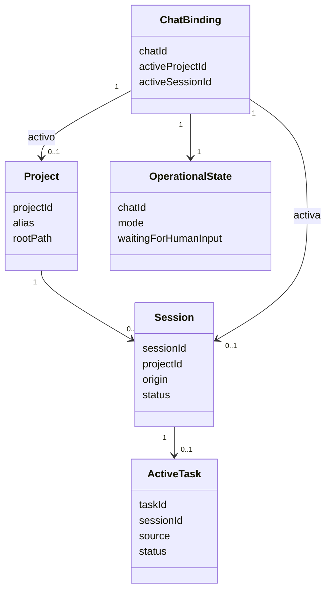
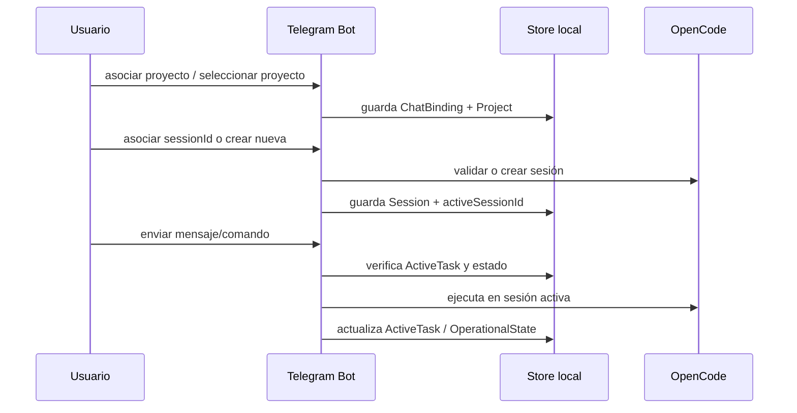
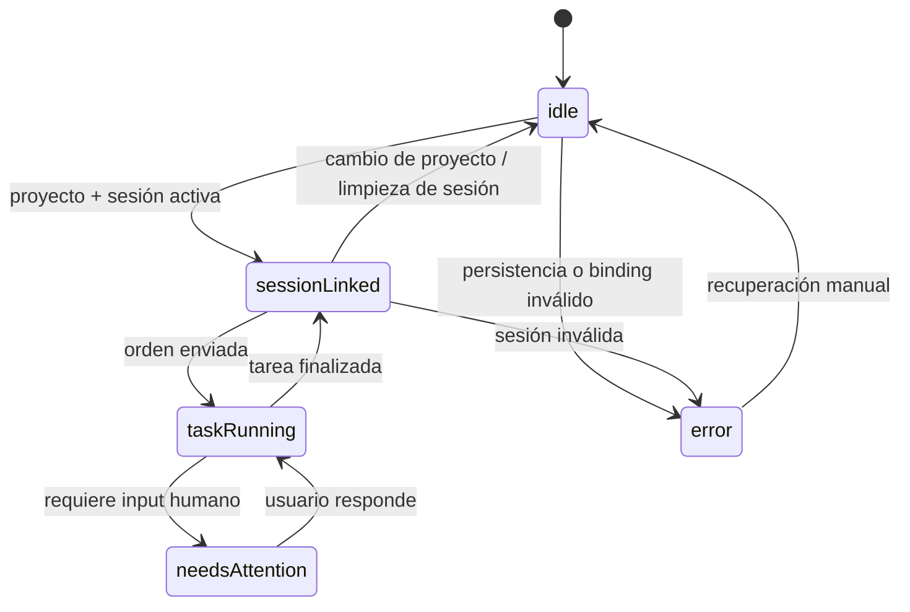

# RFC-002 — Modelo de proyecto, sesión y asociación

## 1. Contexto
El PRD v0.1 redefine `telegram-opencode` como cliente remoto de OpenCode para proyectos locales. La primera entrega usable necesita continuidad mínima: elegir proyecto, asociar o crear sesión y seguirla desde Telegram, incluso después de un reinicio del bot.

## 2. Problema
El prototipo actual solo reenvía texto por HTTP. No modela proyecto, sesión, chat asociado, tarea activa ni estado operativo. Sin ese modelo no hay continuidad, recuperación ni control básico cuando el usuario se va de la PC y quiere retomar desde Telegram.

## 3. Objetivo
Definir el dominio mínimo de v0.1 para operar OpenCode sobre proyectos locales desde Telegram con asociaciones explícitas `chat ↔ proyecto ↔ sesión`, una tarea activa por sesión y estado operativo recuperable.

## 4. Alcance y fuera de alcance
### Entra en v0.1
- Registro local de proyectos.
- Proyecto activo por chat.
- Asociación manual de una sesión existente.
- Creación de nueva sesión para el proyecto activo.
- Tarea activa y estado operativo mínimo.
- Persistencia local mínima para rehidratación.

### Fuera de alcance
- Watcher de sesiones externas y eventos automáticos.
- Confirmaciones del orquestador modeladas en detalle.
- Concurrencia avanzada PC + Telegram.
- Historial completo de tareas o mensajes.
- Multiusuario/roles finos.

## 5. Modelo de entidades propuesto

| Entidad | Campos mínimos | Propósito |
|---|---|---|
| `Project` | `projectId`, `alias`, `rootPath`, `createdAt`, `lastUsedAt?` | Representa un proyecto local operable. |
| `Session` | `sessionId`, `projectId`, `origin` (`linked` \| `created-from-telegram`), `status`, `createdAt`, `lastActivityAt?` | Representa una sesión OpenCode asociable. |
| `ChatBinding` | `chatId`, `activeProjectId?`, `activeSessionId?`, `updatedAt` | Estado operativo actual del chat autorizado. |
| `ActiveTask` | `taskId`, `sessionId`, `source` (`telegram` en v0.1), `status`, `startedAt`, `summary?` | Marca trabajo en curso visible para el bot. |
| `OperationalState` | `chatId`, `mode`, `waitingForHumanInput`, `lastError?` | Snapshot mínimo para `/status` y reanudación básica. |

## 6. Reglas del dominio
- Un `Session` siempre pertenece a un único `Project`.
- Un `ChatBinding` tiene como máximo un `activeProjectId` y una `activeSessionId`.
- No puede haber `activeSessionId` sin `activeProjectId`.
- La sesión activa del chat debe pertenecer al proyecto activo.
- En v0.1 solo existe una `ActiveTask` por `Session`.
- Si cambia el proyecto activo, la sesión activa se limpia salvo reasociación explícita.
- `rootPath` no debe enviarse al chat; solo se usa internamente.
- `OperationalState.mode` mínimo: `idle`, `session-linked`, `task-running`, `needs-attention`, `error`.

## 7. Flujos soportados por este RFC
1. Asociar proyecto a un chat autorizado.
2. Seleccionar/cambiar proyecto activo.
3. Asociar `sessionId` existente al proyecto activo.
4. Crear nueva sesión para el proyecto activo.
5. Consultar estado actual del chat.
6. Enviar una orden a la sesión activa si no hay tarea en curso.
7. Rehidratar contexto tras reinicio.

## 8. Persistencia mínima recomendada
Para v0.1: almacenamiento local embebido simple (archivo JSON o SQLite). Recomendación: **SQLite** si el costo es aceptable, porque evita corrupción por escritura concurrente y facilita evolución; **JSON** sigue siendo válido para el primer corte si solo hay un proceso.

Tablas/colecciones mínimas:
- `projects`
- `sessions`
- `chat_bindings`
- `active_tasks`
- `operational_state`

## 9. Estados y transiciones básicas
- `idle`: chat sin sesión activa usable.
- `session-linked`: hay proyecto y sesión activa.
- `task-running`: existe una tarea activa asociada a la sesión.
- `needs-attention`: la sesión quedó esperando respuesta humana.
- `error`: el binding o la persistencia quedaron inconsistentes.

## 10. Diagramas Mermaid

## 11. Decisiones tomadas
- **Proyecto como entidad estable**: no inferirlo desde la sesión; hace falta para crear o reasociar sesiones.
- **Binding centrado en el chat**: v0.1 optimiza un contexto activo por chat, no un workspace multi-contexto.
- **Sesión separada de estado operativo**: `Session` representa identidad; `OperationalState` representa situación actual.
- **Una tarea activa por sesión**: simplifica control básico; la política avanzada queda para RFC-006.
- **Persistencia mínima local obligatoria**: sin esto, v0.1 pierde valor tras reinicio.

## 12. Riesgos y preguntas abiertas
- Validar si OpenCode expone una verificación confiable de `sessionId` existente.
- Confirmar si `taskId` existe en la API o debe generarlo el bot en v0.1.
- Definir si la persistencia inicial será JSON o SQLite.
- Resolver en RFC futuro qué pasa si la PC sigue usando la misma sesión mientras Telegram también la usa.

## 13. Impacto sobre el prototipo actual
### Se reutiliza
- Bot local por polling.
- Configuración `.env`.
- Logging simple.
- Cliente hacia OpenCode como base del futuro adaptador.

### Se reemplaza o evoluciona
- `handlers.ts`: deja de asumir “texto libre → respuesta directa”.
- `opencode.ts`: pasa de contrato de prompt simple a contrato orientado a sesión.
- Mensaje de bienvenida genérico: se reemplaza por estado/contexto real.
- Estado en memoria (`welcomedChats`): se reemplaza por persistencia mínima del dominio.

## 14. Criterios de aceptación de este RFC
- Define entidades mínimas y sus relaciones sin depender de watcher.
- Explica qué entra en v0.1 y qué queda para RFCs futuros.
- Permite modelar el caso principal: irse de la PC y continuar desde Telegram usando proyecto/sesión ya asociados.
- Establece reglas para proyecto activo, sesión activa, tarea activa y estado operativo.
- Propone persistencia mínima compatible con reinicio del bot.
- Identifica qué partes del prototipo actual se reutilizan y cuáles deben evolucionar.
