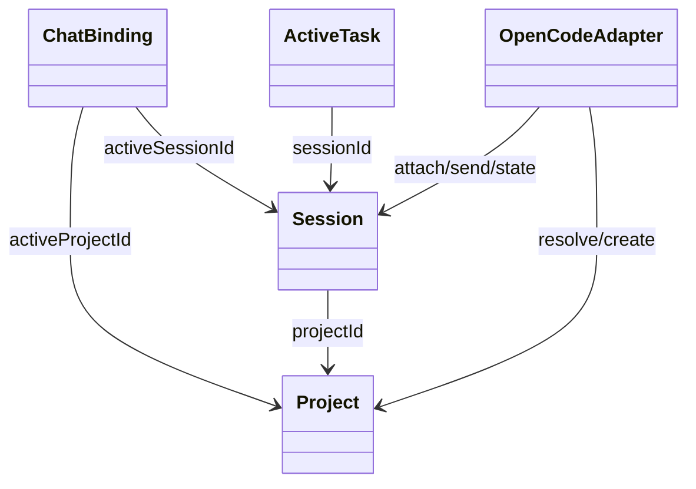
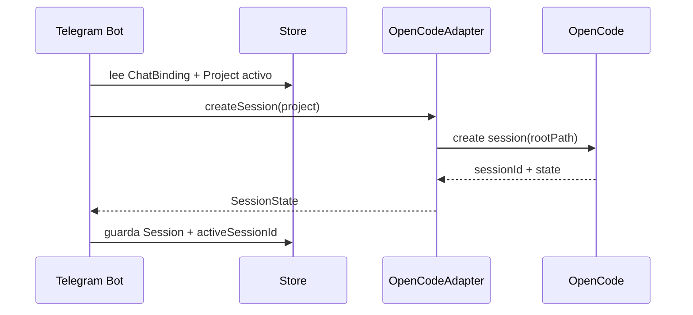
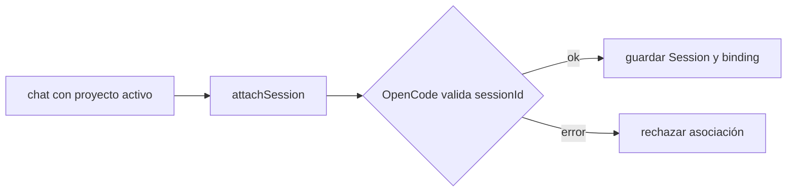
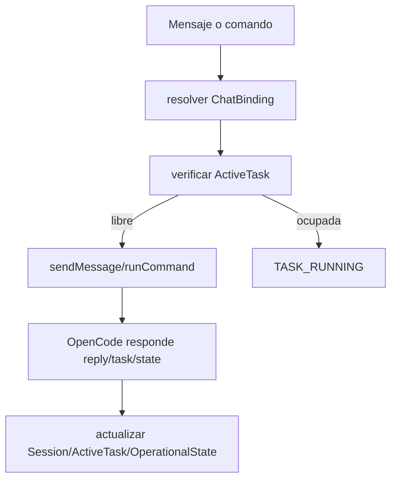

# RFC-003 — API/adaptador OpenCode para sesiones remotas

## 1. Contexto
El PRD v0.1 pide pasar de un bot que reenvía texto por HTTP a un cliente remoto de OpenCode orientado a proyecto y sesión. RFC-002 ya definió `Project`, `Session`, `ChatBinding` y `ActiveTask`; falta definir la capa que conecta ese modelo con OpenCode.

## 2. Problema
El contrato actual (`prompt -> answer`) sirve como mock de conversación simple, pero no resuelve tres necesidades reales: identificar sobre qué proyecto corre OpenCode, asociar o crear una sesión reutilizable y ejecutar trabajo sobre una sesión activa con estado observable. Sin ese adaptador, Telegram no puede operar como consola remota.

## 3. Objetivo
Definir una API/adaptador mínima entre bot y OpenCode para v0.1 que soporte:
- crear nueva sesión sobre un proyecto,
- asociar una sesión existente,
- ejecutar mensajes o comandos sobre la sesión activa,
- consultar estado básico,
- dejar preparado un punto de extensión para futura observación/eventos.

## 4. Alcance y fuera de alcance
### Entra en este RFC
- Contrato lógico del adaptador.
- Resolución de `projectId/rootPath` hacia OpenCode.
- Operaciones mínimas sin watcher.
- Timeouts, errores y semántica básica de respuesta.
- Compatibilidad incremental con el mock/prototipo actual.

### Fuera de alcance
- UX detallada de comandos de Telegram.
- Watcher completo, stream de eventos o notificaciones push externas.
- Diseño fino de concurrencia; solo precondiciones mínimas.
- Protocolo definitivo de confirmaciones humanas.

## 5. Principios de diseño del adaptador
- **Orientado a sesión**: el bot no habla en términos de prompt suelto sino de proyecto + sesión + operación.
- **OpenCode encapsulado**: handlers de Telegram no conocen HTTP ni endpoints concretos.
- **Compatibilidad incremental**: v0.1 puede seguir usando HTTP síncrono y mock local.
- **Respuestas normalizadas**: éxito, error, timeout y “requiere atención” deben salir con forma consistente.
- **Preparado para observación**: incluir identificadores y metadatos suficientes para que un watcher futuro pueda engancharse sin romper el contrato base.
- **Separación de identidad y ejecución**: una cosa es validar/crear una sesión; otra, correr trabajo sobre ella.

## 6. Operaciones mínimas que debe soportar el adaptador
1. **`resolveProject`**: validar que el proyecto asociado es operable por OpenCode.
2. **`createSession`**: crear una nueva sesión para un proyecto.
3. **`attachSession`**: validar y asociar una sesión existente a un proyecto.
4. **`sendMessage`**: enviar texto libre a la sesión activa.
5. **`runCommand`**: ejecutar una orden estructurada sobre la sesión activa.
6. **`getSessionState`**: consultar estado resumido de la sesión y tarea activa.
7. **`cancelOrInterrupt`**: opcional para v0.1; si no existe, el adaptador debe declararlo explícitamente como `unsupported`.
8. **`observeSession`**: no implementado en v0.1, pero reservado como interfaz futura.

## 7. Contratos conceptuales propuestos
```ts
type ProjectRef = {
  projectId: string;
  rootPath: string;
  alias?: string;
};

type SessionRef = {
  sessionId: string;
  projectId: string;
};

type AdapterResult<T> = {
  ok: boolean;
  data?: T;
  error?: {
    code:
      | "PROJECT_NOT_FOUND"
      | "SESSION_NOT_FOUND"
      | "SESSION_PROJECT_MISMATCH"
      | "TASK_RUNNING"
      | "TIMEOUT"
      | "UNAVAILABLE"
      | "UNSUPPORTED"
      | "UNKNOWN";
    message: string;
    retryable?: boolean;
  };
};

type SessionState = {
  sessionId: string;
  projectId: string;
  status: "idle" | "running" | "needs-attention" | "completed" | "unknown";
  activeTaskId?: string;
  summary?: string;
  lastActivityAt?: string;
};
```

### Operaciones
- `resolveProject(input: ProjectRef) -> AdapterResult<{ canonicalPath: string }>`
- `createSession(input: { project: ProjectRef; source: "telegram" }) -> AdapterResult<SessionState>`
- `attachSession(input: { project: ProjectRef; sessionId: string }) -> AdapterResult<SessionState>`
- `sendMessage(input: { session: SessionRef; message: string; chatId: string }) -> AdapterResult<{ taskId?: string; reply?: string; state: SessionState }>`
- `runCommand(input: { session: SessionRef; command: string; args?: Record<string, unknown>; chatId: string }) -> AdapterResult<{ taskId?: string; ack?: string; state: SessionState }>`
- `getSessionState(input: { session: SessionRef }) -> AdapterResult<SessionState>`
- `observeSession(input: { session: SessionRef }) -> AdapterResult<{ mode: "not-available-yet" }>`

## 8. Manejo de errores y timeouts
- **Timeout corto interactivo** en llamadas de control (`resolveProject`, `attachSession`, `getSessionState`).
- **Timeout mayor** en `sendMessage/runCommand`, pero con respuesta en dos etapas cuando sea posible: acuse rápido + resultado final.
- Si OpenCode responde 5xx o timeout, el adaptador normaliza a `UNAVAILABLE` o `TIMEOUT` y marca `retryable=true`.
- Si la sesión no pertenece al proyecto activo, devolver `SESSION_PROJECT_MISMATCH`; NO reasociar en silencio.
- Si hay tarea en curso y la política de v0.1 bloquea nuevas órdenes, devolver `TASK_RUNNING`.
- Logs internos pueden guardar `rootPath`; respuestas a Telegram no.

## 9. Relación con Project / Session / ChatBinding / ActiveTask
- `Project` entrega el `rootPath` que el adaptador necesita para crear o validar contexto remoto.
- `Session` guarda la identidad devuelta o validada por `createSession/attachSession`.
- `ChatBinding` define qué `Project` y `Session` usar por defecto en cada operación.
- `ActiveTask` se alimenta con `taskId` real si OpenCode lo expone; si no, v0.1 puede generar uno local para seguimiento básico.



## 10. Estrategia para v0.1 y camino de evolución
### v0.1 realista
- Mantener el transporte HTTP actual.
- Evolucionar `src/opencode.ts` de cliente `query` simple a `OpenCodeAdapter`.
- Extender el mock local para exponer endpoints de sesión, aunque sigan siendo in-memory.
- Permitir que `sendMessage` siga devolviendo respuesta directa si OpenCode todavía no maneja `taskId`.

### Evolución posterior
- Incorporar `taskId` y estados más ricos.
- Separar acuse inmediato de resultado final.
- Implementar `observeSession` y polling/event stream en RFC-007.
- Modelar confirmaciones humanas en RFC-008.

## 11. Diagramas Mermaid
### Crear nueva sesión


### Asociar sesión existente


### Ejecutar sobre sesión activa


## 12. Decisiones tomadas
- **El adaptador expone operaciones de dominio, no endpoints crudos**.
- **`attachSession` y `createSession` son operaciones separadas** para evitar semántica ambigua.
- **El proyecto se pasa por referencia estable (`projectId`) y ruta interna (`rootPath`)**.
- **`runCommand` no reemplaza `sendMessage`**: texto libre y órdenes estructuradas tienen semánticas distintas.
- **`observeSession` queda reservada desde ahora**, pero su implementación se difiere.

## 13. Riesgos y preguntas abiertas
- OpenCode puede no exponer hoy validación de sesión por `projectId/rootPath`.
- Puede no existir `taskId`; en ese caso v0.1 seguirá parcialmente síncrono.
- Falta decidir si la creación de sesión requiere solo `rootPath` o también metadata adicional.
- Si la misma sesión se usa desde PC y Telegram, el adaptador solo detectará conflicto cuando exista señal de estado suficiente.

## 14. Impacto sobre el código/prototipo actual
### Se reutiliza
- `axios`, timeout y retry básico en `src/opencode.ts`.
- Bot por polling y configuración `.env`.
- Mock HTTP local como base de laboratorio.

### Debe cambiar
- `src/opencode.ts`: pasar de `callOpenCode(prompt)` a adaptador con operaciones de sesión.
- `src/handlers.ts`: dejar de invocar un único flujo texto→respuesta.
- `mock/opencode-mock.ts`: agregar endpoints/acciones de proyecto y sesión.
- Configuración: posiblemente separar `OPEN_CODE_URL` base de rutas específicas del adaptador.

## 15. Criterios de aceptación de este RFC
- Define cómo Telegram pasa proyecto y sesión hacia OpenCode.
- Cubre crear sesión, asociar sesión existente y ejecutar sobre sesión activa.
- Explica qué resuelve v0.1 con el prototipo actual y qué queda para RFCs futuros.
- Propone contratos conceptuales claros con inputs/outputs y errores normalizados.
- Deja un punto explícito de extensión para observación futura sin diseñar todavía el watcher.
