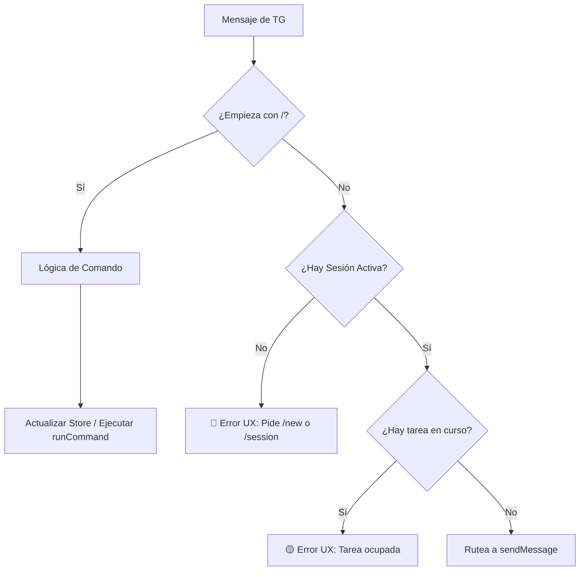

# RFC-004 — UX de Telegram como Control Remoto

## 1. Contexto
El PRD v0.1 y los RFCs 002 y 003 establecen que Telegram funcionará como un cliente remoto para interactuar con proyectos y sesiones locales de OpenCode. Para que el usuario pueda gestionar entidades (`Project`, `Session`) y operar sobre ellas (`sendMessage`, `runCommand`), es necesario diseñar la Experiencia de Usuario (UX) conversacional en Telegram.

## 2. Problema
Actualmente, el bot de Telegram funciona como un simple puente que reenvía cualquier texto recibido a un endpoint HTTP sin contexto. No tiene forma de distinguir instrucciones administrativas (cambiar de proyecto) de instrucciones operativas (escribir código). Sin un diseño de UX estricto y un catálogo de comandos, el usuario no puede aprovechar el modelo de asociaciones (RFC-002) ni la nueva API de sesiones (RFC-003).

## 3. Objetivo
Definir la UX conversacional del bot de Telegram actuando como consola remota de OpenCode. Esto incluye establecer el catálogo de comandos, definir el ruteo de mensajes libres, estandarizar las respuestas visuales y el manejo de errores para proveer una experiencia fluida y predecible.

## 4. Alcance y fuera de alcance

### Entra en v0.1
- Catálogo de comandos de gestión de contexto (proyecto y sesión).
- Reglas estrictas de ruteo para texto libre vs. comandos.
- Formatos estandarizados de respuestas y estados visuales.
- Mensajes de error específicos ante falta de contexto o concurrencia.
- Manejo conversacional básico de confirmaciones del orquestador mediante texto libre.

### Fuera de alcance (v1.1 o posterior)
- Menús interactivos complejos con botones en línea (Inline Keyboards) para seleccionar proyectos o aprobar tareas.
- Paginación de resultados o historiales largos de conversación en la UI del bot.
- Notificaciones asíncronas originadas por un watcher (RFC-007).

## 5. Catálogo de comandos soportados

Los comandos deben ser cortos y pragmáticos, optimizados para uso móvil.

| Comando | Alias | Descripción y comportamiento |
|---|---|---|
| `/start` o `/help` | - | Muestra un resumen de uso y el estado operativo actual. |
| `/status` | `/st` | Muestra en qué proyecto y sesión está el usuario y el estado de la tarea (idle, running, etc.). |
| `/project <ruta_o_alias>` | `/p` | Selecciona o asocia un proyecto local. Si es exitoso, actualiza el `ChatBinding` e invalida la sesión anterior. |
| `/session <id>` | `/s` | Asocia el chat a una sesión existente (`sessionId`) del proyecto activo usando `attachSession`. |
| `/new` | `/n` | Crea una nueva sesión para el proyecto activo usando `createSession` y la asocia al chat. |
| `/cancel` | `/c` | Intenta interrumpir la tarea en curso (mapea a `cancelOrInterrupt` de RFC-003, o informa que no está soportado en v0.1). |

## 6. Respuestas del bot (formatos, tonos, emojis)

- **Tono:** Pragmático, técnico, directo y conciso. Evitar ser excesivamente verboso para no inundar la pantalla en mobile.
- **Formato:** Usar MarkdownV2 o HTML de Telegram de forma segura para resaltar variables e identificadores.
- **Emojis semánticos (obligatorios en encabezados de estado):**
  - 🟢 Éxito, listo para recibir comandos (Idle).
  - 🟡 Procesando, tarea en curso (Running).
  - 🟠 Pausado, esperando input humano (Needs attention).
  - 🔴 Error, bloqueo o falta de contexto.
  - 📁 Indica contexto de Proyecto.
  - 🔌 Indica contexto de Sesión.

*Ejemplo de respuesta exitosa a un comando:*
> 🟢 **Sesión creada**
> 📁 Proyecto: `telegram-opencode`
> 🔌 Sesión: `sess_9876xyz`
> Ya podés enviar mensajes para empezar a trabajar.

## 7. Manejo de estado visual

Cuando el usuario ejecuta `/status`, o cuando el bot recupera contexto tras un reinicio, debe comunicar de forma inconfundible el contexto operativo (`OperationalState`).

*Ejemplo de `/status` en estado inactivo:*
> 🟢 **Estado del Control Remoto**
> 📁 Proyecto: `telegram-opencode`
> 🔌 Sesión: `sess_9876xyz`
> ⚡️ Estado: Libre (Idle)

*Ejemplo de `/status` con tarea activa:*
> 🟡 **Estado del Control Remoto**
> 📁 Proyecto: `api-backend`
> 🔌 Sesión: `sess_1122abc`
> ⚡️ Estado: Tarea en curso (`task_555`)
> ⏳ Esperá a que termine antes de enviar otra instrucción.

## 8. Manejo de errores de UX

El bot no debe fallar silenciosamente ni responder de forma genérica.

- **Sin proyecto activo:**
  > 🔴 No tenés ningún proyecto activo. Usá `/project <ruta>` para empezar.
- **Sin sesión activa:**
  > 🔴 Proyecto seleccionado (`api-backend`), pero no hay sesión activa. Usá `/session <id>` para reanudar o `/new` para crear una.
- **Concurrencia (Tarea en curso):**
  > 🟡 Ya hay una tarea corriendo en esta sesión. Esperá a que termine o usá `/cancel` para interrumpirla.
- **Error del Adaptador (ej. timeout o desconexión):**
  > 🔴 **Error en OpenCode:** El servicio local no responde (TIMEOUT). Verificá que el proyecto esté corriendo en tu PC.

## 9. Interacción de mensajes libres vs comandos

La regla de ruteo es estricta para evitar que mensajes accidentales inicien flujos costosos:

1. **Mensajes que empiezan con `/`:** Se tratan como comandos de administración del bot o mapean a `runCommand` de la API.
2. **Mensajes de texto libre (sin `/`):**
   - **Precondición 1:** ¿Hay proyecto y sesión activa? Si NO -> **Rechazar:** "🔴 No podés enviar mensajes sin una sesión activa..."
   - **Precondición 2:** ¿El estado es `idle`, `session-linked` o `needs-attention`? Si NO (ej. está `running`) -> **Rechazar:** "🟡 La sesión está ocupada..."
   - **Acción:** Si cumple las precondiciones, el bot rutea el mensaje usando la operación `sendMessage` de RFC-003.

> Nota de decisión (v0.1): `session-linked` se acepta como estado operativo equivalente a `idle` para habilitar continuidad inmediata luego de `/session` o `/new`.

## 10. Confirmaciones humanas

En la versión v0.1, no implementaremos Inline Keyboards. Cuando el adaptador detecte que OpenCode devuelve un estado `needs-attention` (ej. el orquestador pregunta si debe crear un archivo), el bot informará al usuario y esperará texto libre.

*Boceto de UX para confirmación:*
> 🟠 **El orquestador espera tu confirmación:**
> *Se detectaron cambios en 3 archivos. ¿Querés proceder con el commit?*
> 
> 👉 Respondé directamente con un mensaje (ej: "sí, avanzá", o "no, mostrame el diff primero").

Como el estado operativo quedó en `needs-attention`, el próximo mensaje de texto libre ingresará al flujo válido de `sendMessage` permitiendo continuar la sesión.

## 11. Decisiones tomadas
- **Texto libre bloqueado por defecto:** Si no hay sesión válida, el texto libre se rechaza. Esto previene que el usuario pierda tiempo hablando con la nada.
- **Comandos cortos:** Se priorizan los alias de una letra (`/p`, `/s`, `/n`) dada la naturaleza de terminal remota del bot en dispositivos móviles.
- **Ausencia de UI compleja en v0.1:** Las confirmaciones se manejan conversacionalmente en lugar de usar botones nativos de Telegram para mantener simple el adaptador base inicial.

## 12. Riesgos y preguntas abiertas
- **Formateo de respuestas:** OpenCode suele devolver Markdown rico que incluye bloques de código anidados. El parseador estricto de Telegram (MarkdownV2) suele romper y tirar error si hay caracteres sin escapar. *Mitigación:* Se requerirá una función sanitizadora robusta en el bot antes de imprimir en Telegram.
- **Tamaño de mensaje:** Telegram limita los mensajes a 4096 caracteres. Las respuestas del orquestador pueden superarlo. *Pregunta:* ¿Debemos truncar con un aviso o dividir en múltiples mensajes automáticos? (Sugerido para v0.1: truncar el mensaje y pedir al usuario revisar en PC).

## 13. Criterios de aceptación
- Todos los comandos del catálogo están implementados y sus alias funcionan.
- Enviar texto sin sesión activa responde con un error claro y sin excepciones de código.
- Enviar texto con tarea activa avisa inmediatamente del bloqueo de concurrencia.
- La ejecución exitosa de un comando como `/new` o `/project` devuelve el contexto en el formato visual especificado usando emojis semánticos.
- El ruteo documentado en el flujo de Markdown se respeta de forma estricta a nivel código.
