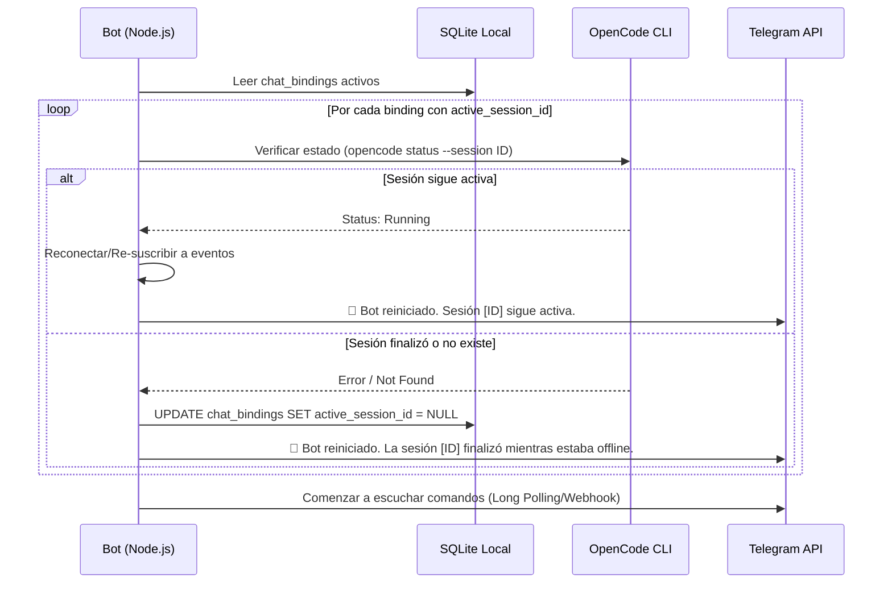

# RFC-005: Persistencia local y recuperación tras reinicio

**Estado:** Propuesto  
**Autor:** AI Architect  
**Fecha:** 14 de Abril de 2026  

## 1. Contexto y Problema

El bot de Telegram (`telegram-opencode`) actúa como un intermediario entre Telegram y el CLI de OpenCode en la máquina local del usuario. Dado que el flujo de trabajo (Nivel 2) permite al usuario iniciar una tarea, irse, y que la tarea quede corriendo en la PC, es fundamental garantizar la **resiliencia del estado**.

Si el proceso de Node.js del bot se reinicia, crashea o se cierra accidentalmente:
1. El bot "olvida" qué proyectos estaban vinculados a qué chat de Telegram.
2. El bot pierde la referencia a la sesión de OpenCode en curso (`session_id`).
3. Al volver a iniciar, el bot ignorará las notificaciones de OpenCode o no sabrá a quién enviarlas, dejando tareas "huérfanas" desde el punto de vista de Telegram (aunque OpenCode siga ejecutándolas).

## 2. Objetivos

- Mantener un registro persistente del `ChatBinding` (Chat ID ↔ Proyecto ↔ Sesión Activa).
- Definir el mecanismo de almacenamiento local adecuado para un entorno de usuario único (CLI local).
- Establecer un flujo de recuperación en el arranque (Boot Recovery Flow) para reconciliar el estado guardado con el estado real de OpenCode.

## 3. Propuesta de Almacenamiento

Al tratarse de una herramienta local pensada para el entorno de desarrollo de un único usuario, no se requiere una base de datos cliente-servidor tradicional.

**Decisión:** Se utilizará **SQLite** (vía `better-sqlite3` o similar) almacenado en una carpeta de configuración del usuario (ej. `~/.config/telegram-opencode/state.db` o dentro de la carpeta del bot). 

*Nota: Una alternativa era un archivo JSON (`state.json`), pero SQLite previene problemas de corrupción de archivos ante cierres abruptos y facilita la expansión futura del esquema.*

### 3.1 Esquema de Datos Mínimo

```sql
CREATE TABLE chat_bindings (
    chat_id TEXT PRIMARY KEY,
    active_project_path TEXT,      -- Ruta absoluta al proyecto seleccionado
    active_session_id TEXT,        -- ID de la sesión en curso (si la hay)
    updated_at DATETIME DEFAULT CURRENT_TIMESTAMP
);
```

*Solo necesitamos rastrear el estado activo por chat. Si el usuario cambia de proyecto, se actualiza el registro.*

## 4. Flujo de Recuperación (Boot Recovery Flow)

Cuando el proceso del bot se inicia, debe ejecutar una rutina de reconciliación antes de aceptar nuevos comandos:



## 5. Escenarios y Edge Cases

### 5.1. El bot muere y OpenCode emite un evento importante
Si OpenCode CLI intenta enviar un webhook o evento al bot y este está caído, el evento se perderá. 
**Mitigación:** Al reiniciar, el bot consulta el estado explícito (`opencode status`). Si la tarea terminó y OpenCode guardó el resultado, el bot leerá que ya no está "Running" y notificará al usuario de acuerdo al estado final.

### 5.2. El usuario elimina el directorio del proyecto
Si la persistencia dice que `chat_id = 123` está apuntando a `/ruta/borrada`, al reiniciar, el bot debe validar si el directorio existe.
**Manejo:** Si el directorio no existe, se anula `active_project_path` y se pide al usuario que vuelva a seleccionar un proyecto (`/project`).

### 5.3. Corrupción de Base de Datos
Si el archivo SQLite se corrompe (extremadamente raro), el bot debe capturar el error en el arranque, renombrar el archivo corrupto a `state.db.bak` y crear uno nuevo vacío, notificando por consola (y por Telegram si el Chat ID se inyecta por ENV temporalmente) que se perdió el contexto.

## 6. Consecuencias

- **Positivas:** El usuario puede apagar y prender el bot sin miedo a perder el hilo de sus tareas remotas. Resiliencia ante caídas de memoria.
- **Negativas:** Añade una dependencia (SQLite) que compila binarios nativos en Node.js, lo cual puede alargar el tiempo de instalación (`npm install`).

## 7. Alternativas consideradas

- **LowDB / JSON local:** Más fácil de instalar (sin binarios nativos), pero más propenso a corrupción de datos si el proceso Node.js muere exactamente durante la escritura. Dado que las escrituras solo ocurren al cambiar de proyecto o sesión, el riesgo es bajo, pero SQLite sigue siendo el estándar de la industria para CLI apps resilientes.
- **Persistencia en Telegram (Mensajes pineados o State Bot):** Demasiado frágil y acoplado a la API externa. La fuente de verdad debe vivir en la PC del usuario.