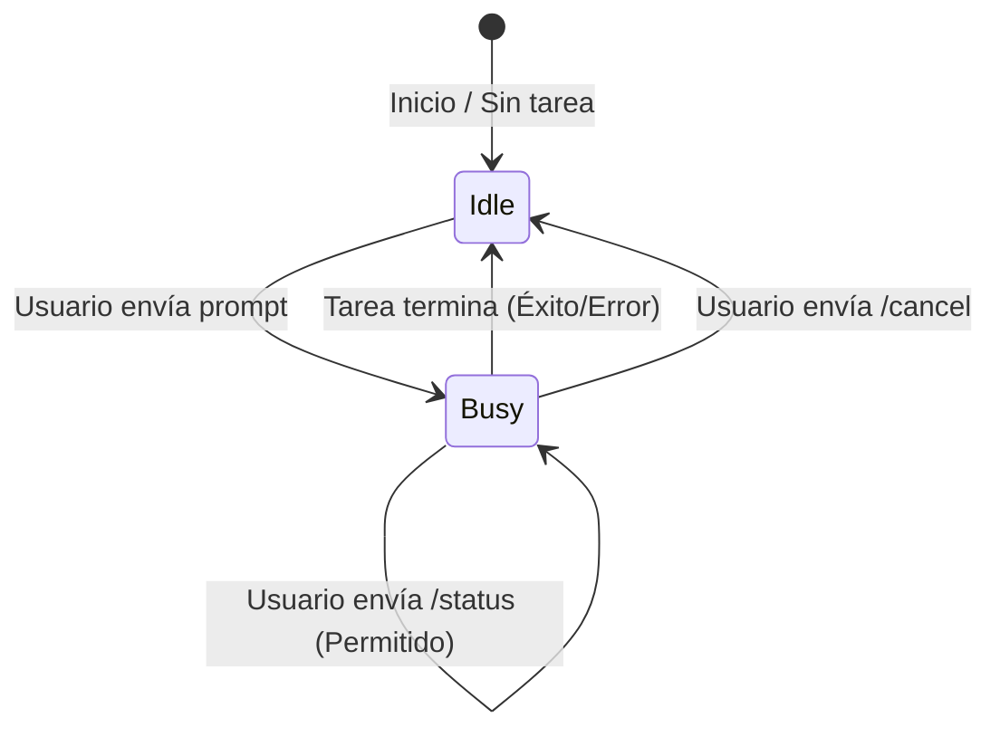

# RFC-006: Concurrencia, locks y política de tarea en curso

**Estado:** Propuesto  
**Autor:** AI Architect  
**Fecha:** 14 de Abril de 2026  

## 1. Contexto y Problema

Telegram es una plataforma inherentemente asíncrona donde un usuario puede enviar múltiples mensajes (comandos) en rápida sucesión. Por otro lado, OpenCode ejecuta tareas en la máquina local que pueden modificar el estado del sistema de archivos (ej. `npm install`, `docker build`).

Si el bot no controla la concurrencia:
1. **Corrupción de estado:** El usuario podría lanzar dos comandos incompatibles al mismo tiempo en el mismo directorio.
2. **Caos en la UX:** Los logs y respuestas de múltiples sesiones se mezclarían en el chat, haciendo imposible entender qué salida corresponde a qué comando.
3. **Sobrecarga de recursos:** Spam de comandos pesados podría agotar la memoria o CPU de la máquina local.

## 2. Objetivos

- Definir la política de ejecución concurrente para el bot.
- Proteger el entorno local de ejecuciones accidentales simultáneas.
- Mantener la experiencia de usuario (UX) en Telegram clara, lineal y predecible.

## 3. Propuesta: Bloqueo Pesimista (Pessimistic Locking) de 1 Tarea a la vez

Dado que la interfaz de chat es un hilo secuencial, la política más sana es **1 Sesión Activa por Chat**.

### 3.1. Reglas del Lock

1. **Estado "Idle" (Libre):** El usuario puede enviar cualquier prompt de texto libre. El bot crea una nueva sesión en OpenCode, bloquea el chat (adquiere el Lock) y comienza a emitir los resultados.
2. **Estado "Busy" (Ocupado):** Mientras la sesión de OpenCode esté en ejecución (Running), el chat entra en estado "Ocupado".
3. **Rechazo de nuevos comandos:** Si el chat está en estado Busy y el usuario envía otro prompt de ejecución, el bot **rechazará** el comando inmediatamente con un mensaje:
   > ⚠️ *Ya hay una tarea en curso (ID: xyz). Usa `/cancel` para detenerla, o espera a que termine.*
4. **Comandos de solo lectura permitidos:** Comandos de gestión y estado como `/status`, `/project` (para ver el actual, no para cambiarlo) y `/cancel` **sí** están permitidos y puentean el Lock.

### 3.2. Mecanismo de Implementación

El Lock existirá tanto en memoria (para rechazo ultra-rápido) como respaldado por la base de datos definida en el RFC-005 (`active_session_id` no es nulo).

## 4. Escenarios y Edge Cases

### 4.1. El proceso hijo (OpenCode) se cuelga (Zombie Process)
Si un comando se queda esperando input (por ejemplo, un prompt interactivo que no fue detectado) o entra en un bucle infinito, el Lock nunca se liberará por sí solo.
**Solución:** El comando `/cancel` actúa como un "Kill Switch". Mata el proceso en OpenCode CLI y fuerza la liberación del Lock en el bot, devolviendo el estado a Idle.

### 4.2. Cambio de proyecto durante una tarea
Si el usuario intenta usar `/project <nuevo_path>` mientras hay una tarea corriendo en el proyecto actual.
**Solución:** Bloquear el cambio de proyecto hasta que la tarea actual termine o sea cancelada. Mensaje: *"No puedes cambiar de proyecto mientras hay una tarea en ejecución."*

### 4.3. Mensajes encolados por Telegram
Si el bot estuvo apagado y al prender recibe 5 comandos de golpe desde los servidores de Telegram.
**Solución:** El bot procesa en orden de llegada (FIFO). El primer comando adquiere el Lock y empieza a correr. Los siguientes 4 comandos chocan contra el Lock y son respondidos con el mensaje de rechazo (⚠️ *Ya hay una tarea en curso...*).

## 5. Consecuencias

- **Positivas:** La arquitectura se simplifica enormemente. No hay que lidiar con multiplexación de logs, ni UI complejas con pestañas en Telegram. Evita romper los repositorios locales.
- **Negativas:** Limita a los usuarios "Power Users" que genuinamente querrían correr el backend y el frontend en paralelo en el mismo chat. 

*Nota sobre la limitación:* Si en el futuro se requiere concurrencia (ej. levantar Base de Datos + Backend + Frontend), se delegará a herramientas como `docker-compose` o scripts `npm-run-all`, manteniendo la abstracción de "1 sola Sesión (comando) desde la perspectiva del Bot".

## 6. Alternativas consideradas

- **Cola de ejecución (Queue):** Encolar los comandos y correrlos uno tras otro. *Descartado* porque en un entorno interactivo de desarrollo, los comandos suelen depender del éxito del anterior. Si el primero falla, correr el segundo ciegamente es peligroso.
- **Multiplexación / Múltiples Sesiones:** Permitir N sesiones y que el usuario haga `/switch <session_id>`. *Descartado* para la v0.1 por complejidad extrema de UX en Telegram. Es mejor forzar al usuario a usar un script de orquestación si necesita levantar múltiples cosas.