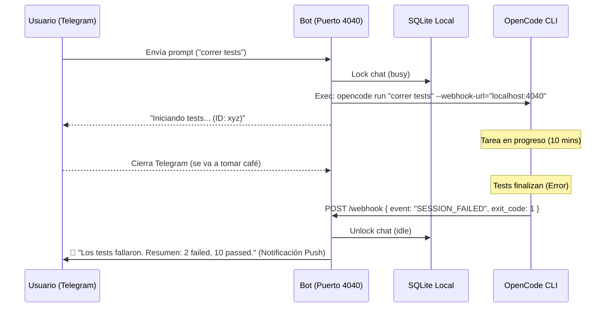

# RFC-007: Watcher de sesión y notificaciones de eventos externos

**Estado:** Propuesto  
**Autor:** AI Architect  
**Fecha:** 14 de Abril de 2026  

## 1. Contexto y Problema

Uno de los principales motivos del "pivot" hacia la arquitectura orientada a sesiones (Nivel 2) es la necesidad de **asincronismo verdadero** en el bot de Telegram. 

El usuario puede iniciar una tarea de larga duración en OpenCode (ej. un pipeline de CI local o el entrenamiento de un modelo), abandonar la PC, cerrar la ventana de chat, y esperar recibir una notificación push en Telegram cuando termine.

Sin embargo, el CLI de OpenCode ejecuta procesos hijo que, por defecto, están desvinculados de la red pública. Si el proceso de OpenCode finaliza, el bot de Telegram no lo sabrá automáticamente a menos que haya un mecanismo de **notificación ("Push")** o un **monitoreo ("Pull/Watch")**.

## 2. Objetivos

- Definir cómo el bot de Telegram se entera de los cambios de estado en una sesión de OpenCode.
- Establecer el canal de comunicación local entre el proceso de OpenCode (CLI/Agent) y el proceso de Node.js del bot.
- Garantizar la entrega de la notificación final al usuario ("Success", "Error" o requerimiento de input).

## 3. Propuesta Arquitectónica: IPC Local vía Webhooks

Dado que el bot y el CLI de OpenCode coexisten en la misma máquina física o contenedor, la comunicación más confiable es mediante **Inter-Process Communication (IPC)** utilizando HTTP local.

### 3.1. Arquitectura "Local Webhook Receiver"

1. **El Bot expone un servidor HTTP local mínimo:**
   El bot de Telegram levantará un mini-servidor Express.js (o `node:http`) escuchando en `localhost:4040` (configurable).
   Ruta principal: `POST /webhooks/opencode/events`

2. **OpenCode CLI actúa como emisor (Webhook Sender):**
   Al arrancar OpenCode mediante el comando `opencode run`, el bot pasará un parámetro (o variable de entorno) indicando su URL de retorno.
   Ejemplo conceptual: `opencode run "npm install" --webhook-url="http://localhost:4040/webhooks/opencode/events" --session="xyz"`

3. **Eventos a escuchar:**
   OpenCode emitirá un payload JSON (POST) al bot cuando ocurra un cambio de estado significativo. Los principales eventos son:
   - `SESSION_STARTED` (Confirmación inicial)
   - `SESSION_COMPLETED` (Éxito, exit code 0)
   - `SESSION_FAILED` (Error, exit code > 0 o timeout)
   - `SESSION_NEEDS_INPUT` (El agente de OpenCode requiere confirmación humana para continuar, ej. "Judgment Day" o un comando destructivo).

### 3.2. Payload del Evento (Esquema Propuesto)

```json
{
  "event": "SESSION_COMPLETED",
  "session_id": "sess-xyz-123",
  "project_path": "/mnt/d/Proyectos/telegram-opencode",
  "timestamp": "2026-04-14T20:30:00Z",
  "data": {
    "exit_code": 0,
    "summary": "Dependencias instaladas exitosamente. 20 packages added.",
    "output_tail": "... últimos 5 renglones de log para contexto ..."
  }
}
```

## 4. Flujo de Trabajo (El "Watcher")



## 5. Escenarios y Edge Cases

### 5.1. OpenCode muere silenciosamente (OOM Kill, Crash OS)
Si el sistema operativo mata a OpenCode por falta de memoria (Out Of Memory), este no podrá enviar el webhook `SESSION_FAILED`. El bot se quedaría esperando infinitamente ("Zombie Lock").
**Mitigación - Watchdog Timer:**
Además de escuchar webhooks, el bot debe implementar un "Polling de Respaldo". Cada X minutos, el bot hace `opencode status --session xyz`. Si OpenCode responde que la sesión ya no existe y no se recibió webhook, el bot asume un crash silencioso, libera el Lock y notifica al usuario del fallo abrupto.

### 5.2. El puerto 4040 está ocupado
Si el usuario ya tiene otro servicio corriendo en ese puerto local.
**Mitigación:** El bot debe intentar levantar el servidor HTTP probando puertos incrementales (4040, 4041, 4042) y pasarle a OpenCode el puerto exitoso en el momento del `run`.

### 5.3. Seguridad del Webhook Local
Cualquier otro proceso en la máquina podría hacer un `POST localhost:4040` y falsificar eventos.
**Mitigación:** Al crear la sesión, el bot generará un token aleatorio efímero (HMAC o UUID) que OpenCode debe incluir en el header `Authorization: Bearer <token>`. El bot rechazará cualquier webhook sin ese token o con uno inválido.

## 6. Consecuencias

- **Positivas:** Desacopla completamente el ciclo de vida del bot de Telegram del ciclo de vida de las tareas pesadas de OpenCode. Habilita notificaciones push reales asíncronas.
- **Negativas:** Exige levantar un mini-servidor HTTP extra dentro de la aplicación Node.js del bot, consumiendo un puerto local adicional.

## 7. Alternativas consideradas

- **Tail file log:** El bot lee continuamente un archivo `.opencode/sessions/xyz.log` buscando una palabra clave como `[COMPLETED]`. *Descartado* por ser frágil, propenso a errores de parseo si la salida del programa imprime accidentalmente esa misma palabra, y poco performante por el I/O intensivo de disco.
- **Polling constante:** Hacer `opencode status` cada 5 segundos. *Descartado* como mecanismo primario por ineficiencia e impacto en CPU, pero retenido como mecanismo secundario (Watchdog de respaldo) para crashes silenciosos.